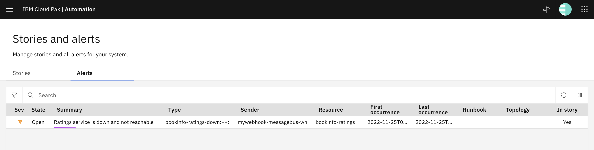
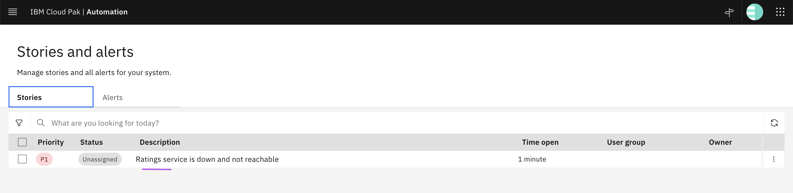
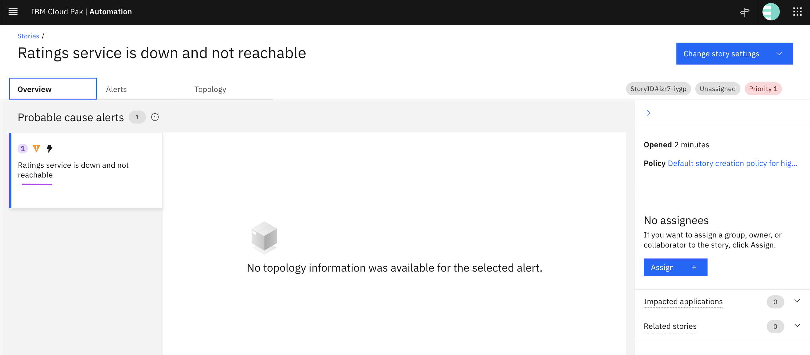
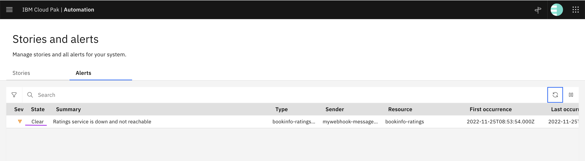
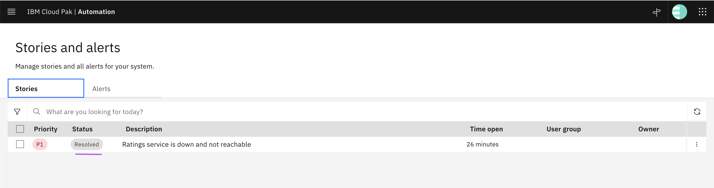

# Generic Webhook Probe to push Events in Watson AIOps AI Manager

This article explains about Installing and using the Generic Webhook Probe in IBM Watson AIOps AI Manager 3.5.0, to push events.

Installation scripts are available here [files](./files).  Download and keep the files locally.


## 1. Install Generic Webhook

## 1.1. Update Properties

Update the below properties in [files/data/00-config1.sh](./files/data/00-config1.sh) file .

```
export ENTITLEMENT_KEY=eyJhbG...........................e4Zog

export WEBHOOK_PASSWORD=......
```

#### 1.2. Login to OCP Cluster

Login to OCP cluster where AI-Manager is installed using  `oc login` command .

#### 1.3. Run the install script

Go to the `files` folder and Run the install script as like below.

```
cd files
sh 10-install.sh
```

- It would take couple of minutes to complete the installation. 
- The same script can be run again and again if the install stopped for any reason.

#### 1.4. Output
 
The installation would be completed and the output could be like this.

```
PROBE_WEBHOOK_URL=https://mywebhook-mb-webhook-cp4waiops.aaaaaaaa/probe/generic
```

The property file in [files/data/00-config2.sh](./files/data/00-config2.sh) file should have been updated with the above printed webhook url. 

You can use this link to push alerts.

## 2. Pushing Events

A sample event is available here [files/data/my-event.json](./files/data/my-event.json).

Lets push this event to the WAIOPS using the above created webhook.

#### 2.1. Run the script

Go to the `files` folder and Run the below script as like below.

```
sh 20-push-event.sh
```

#### 2.2. View Results

The Alert should have been created and can be seen in the WAIOPS console.



A Story could have been created like these.




#### 2.3. Event Data

The below fields are important.

```
      "SERIAL": 10001,
      "EventId": "bookinfo-ratings-down",
      "Node": "bookinfo-ratings",
      "Severity": 4,
      "Summary": "Ratings service is down and not reachable",
      "NetcoolEventAction": "insert",
      "Type": 1,

```

- The value 1 in the field `Type` represents issue/problem.


## 3. Clearing Events

A Sample event is available here [files/data/my-event-clear.json](./files/data/my-event-clear.json).

#### 3.1. Run the script

Go to the `files` folder and Run the below script as like below.

```
sh 30-clear-event.sh
```

#### 3.2. View Results

The status of Alert and story should have been like the below in the WAIOPS console.





#### 3.3. Event Data

The below fields are important for clearing.

```
      "NetcoolEventAction": "update",
      "Type": 2,
```

- The value 2 in the field `Type` represents resolution/clear.


## Reference

The script is based out of the following IBM documentations.

https://www.ibm.com/docs/en/cloud-paks/cloud-pak-watson-aiops/3.5.0?topic=integration-probe-sevone-npm-ai-manager

https://www.ibm.com/docs/en/cloud-paks/cloud-pak-watson-aiops/3.5.0?topic=reference-normalized-alert-mapping-rules
